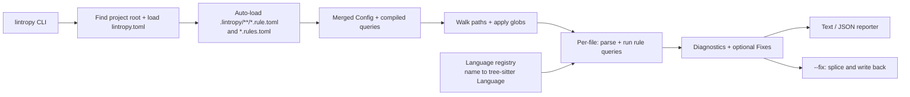

## Architecture



## DSL: what `lintropy.toml` looks like

```toml
# Global config (optional)
[lintropy]
fail_on = "warning"        # exit non-zero if any diagnostic >= this severity

[[rules]]
id        = "no-unwrap"
language  = "rust"
severity  = "warning"      # error | warning | info
message   = "Avoid `.unwrap()` on `{{recv}}`; prefer `.expect(\"...\")` or `?`."
include   = ["**/*.rs"]    # optional, defaults to language's extensions
exclude   = ["tests/**", "**/tests.rs"]   # optional
fix       = '{{recv}}.expect("TODO: handle error")'   # optional autofix replacing @match
query = '''
(call_expression
  function: (field_expression
    value: (_) @recv
    field: (field_identifier) @method)
  arguments: (arguments)
  (#eq? @method "unwrap")
  (#not-has-ancestor? @method "macro_invocation")) @match   # skip e.g. assert!(x.unwrap())
'''
```

Semantics:
- Each match of `query` against a file in the rule's language produces one diagnostic.
- Span is taken from the `@match` capture if present, otherwise the whole match root.
- `message` supports `{{capture_name}}` interpolation using the captured node's source text. Unknown captures render as empty string and emit a warning at config-load time.
- Tree-sitter's built-in predicates (`#eq?`, `#match?`, `#not-eq?`, etc.) are supported for free since we delegate to `tree_sitter::QueryCursor`.
- Custom predicates are recognized by name from `Query::general_predicates()` and applied as a post-filter against each match (see "Custom predicates" below).
- `fix`, when present, is a `{{capture}}`-interpolated replacement for the `@match` span (or query root if `@match` is absent). Without `--fix` the diagnostic just shows the suggested replacement; with `--fix` we rewrite files in place.

## Rule layout: one big file, or one file per rule

A real codebase will accumulate dozens of personalized rules. Forcing all of them into a single `lintropy.toml` would make code review and ownership painful. So `lintropy` supports both styles, and you can mix them freely.

### Discovery

1. Find the **project root**: walk up from the cwd (or from `--config`'s parent) looking for `lintropy.toml`. That file anchors the project; it may be empty except for `[lintropy]` global config.
2. From the project root, auto-load every file matching `.lintropy/**/*.rule.toml` and `.lintropy/**/*.rules.toml`. No registration needed — drop the file in, it's live.
3. All rules are merged into a single in-memory list. Duplicate `id`s are a hard error at load time, with both source paths in the message.

### File formats

`lintropy.toml` (project root) — global config, plus optional inline rules:

```toml
[lintropy]
fail_on = "warning"

# Inline rules still work for small projects.
[[rules]]
id = "no-dbg"
# ...
```

`.lintropy/<anything>.rule.toml` — **single rule per file**. The top-level keys *are* the rule fields; no `[[rules]]` wrapper. The `id` defaults to the file stem if omitted, so `.lintropy/no-unwrap.rule.toml` with no `id` becomes the `no-unwrap` rule. This makes per-rule files trivially short:

```toml
# .lintropy/no-unwrap.rule.toml
language = "rust"
severity = "warning"
message  = "Avoid `.unwrap()` on `{{recv}}`; prefer `.expect(\"...\")` or `?`."
fix      = '{{recv}}.expect("TODO: handle error")'
query = '''
(call_expression
  function: (field_expression
    value: (_) @recv
    field: (field_identifier) @method)
  arguments: (arguments)
  (#eq? @method "unwrap")
  (#not-has-ancestor? @method "macro_invocation")) @match
'''
```

`.lintropy/<anything>.rules.toml` — **multiple rules per file** for natural groupings (e.g. all the migration rules for a sprint):

```toml
# .lintropy/2026q2-migrations.rules.toml
[[rules]]
id = "use-tracing-not-log"
# ...

[[rules]]
id = "old-config-removed-2026Q2"
# ...
```

### Why this design

- **Per-rule files work nicely with code review and CODEOWNERS** — a team can own `.lintropy/auth/*.rule.toml` without owning the whole config.
- **Subdirectories under `.lintropy/` are allowed and meaningful** (`.lintropy/architecture/`, `.lintropy/migrations/`) — they're purely organizational, the discovery glob is recursive.
- **Disabling a rule is `git rm`** of one file, not editing a 600-line TOML.
- **No registry / no manifest** — adding a rule is one new file. Removing one is `rm`.

### Implementation note

In `src/config.rs`, after reading the root `lintropy.toml`, glob the `.lintropy/` tree (using the `ignore` crate so `.gitignore` is respected). For each file:
- `*.rule.toml` → `toml::from_str::<RuleConfig>` directly, default `id` to file stem if missing.
- `*.rules.toml` → `toml::from_str::<RuleFile>` where `RuleFile { rules: Vec<RuleConfig> }`.
Tag every rule with its `source_path` so error messages and `lintropy explain` can point users back to the file that defined the rule.

## Why this matters: personalized rules, not generic ones

Clippy, ESLint, Pylint and friends ship a fixed catalog of *generic* rules. The interesting lints in any real codebase are the ones that encode **that team's conventions** — things no upstream linter could ever ship because they're specific to your domain, your architecture, or your ongoing migration. `lintropy` is for those.

Categories of high-value codebase-specific rules, with the kind of query that would express them:

### 1. Architectural boundaries
Encode "layer X cannot reach into layer Y" using `include`/`exclude` globs plus a `use_declaration` query.
> "Anything under `crates/domain/**` may not `use crate::infra::*`."

```toml
[[rules]]
id       = "domain-no-infra"
language = "rust"
severity = "error"
include  = ["crates/domain/**/*.rs"]
message  = "domain crate must not depend on infra (found `use {{path}}`)"
query = '''
(use_declaration
  argument: [
    (scoped_identifier) @path
    (scoped_use_list)   @path
    (use_as_clause)     @path
  ]
  (#match? @path "^(crate::)?infra(::|$)")) @match
'''
```

### 2. Migration enforcement (with autofix)
You're moving the codebase from `OldThing` to `NewThing`. Generic linters don't know about your `OldThing`.
> "Replace `log::info!(...)` with `tracing::info!(...)`."

```toml
[[rules]]
id       = "use-tracing-not-log"
language = "rust"
severity = "warning"
message  = "use `tracing::{{level}}!` instead of `log::{{level}}!`"
fix      = "tracing::{{level}}!{{args}}"
query = '''
(macro_invocation
  macro: (scoped_identifier
    path: (identifier) @ns
    name: (identifier) @level)
  (token_tree) @args
  (#eq? @ns "log")
  (#match? @level "^(trace|debug|info|warn|error)$")) @match
'''
```

### 3. Banned APIs / banned imports
Generic "don't use X" lists, but X is *your* X.
> "No `dbg!` left in non-test code."

```toml
[[rules]]
id       = "no-dbg"
language = "rust"
severity = "error"
include  = ["src/**/*.rs"]
exclude  = ["**/tests.rs", "**/tests/**", "tests/**"]
message  = "stray `dbg!` in non-test code"
query = '''
(macro_invocation
  macro: (identifier) @name
  (#eq? @name "dbg")) @match
'''
```

### 4. Required patterns / required ceremony
Force conventions a generic linter could never enforce.
> "Every `#[tokio::test]` function name must start with `test_`."

```toml
[[rules]]
id       = "test-name-prefix"
language = "rust"
severity = "warning"
message  = "test function `{{name}}` must start with `test_`"
query = '''
(function_item
  (attribute_item
    (attribute
      (scoped_identifier
        path: (identifier) @ns
        name: (identifier) @attr)))
  name: (identifier) @name
  (#eq? @ns "tokio")
  (#eq? @attr "test")
  (#not-match? @name "^test_")) @match
'''
```

> "Every TODO/FIXME comment must reference a ticket: `// TODO(PROJ-123): ...`."

```toml
[[rules]]
id       = "todo-needs-ticket"
language = "rust"
severity = "warning"
message  = "TODO/FIXME comments must include a ticket id, e.g. `// TODO(PROJ-123): ...`"
query = '''
((line_comment) @c
  (#match?     @c "^// (TODO|FIXME)\\b")
  (#not-match? @c "^// (TODO|FIXME)\\([A-Z]+-[0-9]+\\):")) @match
'''
```

> "Every `unsafe` block must be preceded by a `// SAFETY:` comment." *(needs the post-MVP `#has-preceding-comment?` predicate.)*

```toml
[[rules]]
id       = "safety-comment-required"
language = "rust"
severity = "error"
message  = "`unsafe` block needs a `// SAFETY:` comment explaining invariants"
query = '''
(unsafe_block
  (#not-has-preceding-comment? @match "^// SAFETY:")) @match
'''
```

### 5. Domain-specific taxonomies
Your codebase has its own naming rules.
> "Metric names passed to `metrics::{counter,gauge,histogram}!` must match `app.<domain>.<event>`."

```toml
[[rules]]
id       = "metric-naming"
language = "rust"
severity = "error"
message  = "metric name {{name}} doesn't match required taxonomy `app.<domain>.<event>`"
query = '''
(macro_invocation
  macro: (scoped_identifier
    path: (identifier) @ns
    name: (identifier) @kind)
  (token_tree (string_literal) @name)
  (#eq?        @ns   "metrics")
  (#match?     @kind "^(counter|gauge|histogram)$")
  (#not-match? @name "^\"app\\.[a-z_]+\\.[a-z_]+\"$")) @match
'''
```

### 6. Test-suite discipline
> "No `#[ignore]` outside `tests/flaky/`."

```toml
[[rules]]
id       = "no-stray-ignore"
language = "rust"
severity = "error"
include  = ["**/*.rs"]
exclude  = ["tests/flaky/**"]
message  = "`#[ignore]` is only allowed under tests/flaky/"
query = '''
(attribute_item
  (attribute (identifier) @attr)
  (#eq? @attr "ignore")) @match
'''
```

### 7. Project-specific deprecations with deadlines
> "`OldConfig::load()` is being removed 2026-06-30 — autofix to `AppConfig::from_env()`."

```toml
[[rules]]
id       = "old-config-removed-2026Q2"
language = "rust"
severity = "error"            # was "warning" until April; now hard-error in CI
message  = "OldConfig::load is removed 2026-06-30; use AppConfig::from_env()"
fix      = "AppConfig::from_env()"
query = '''
(call_expression
  function: (scoped_identifier
    path: (identifier) @ty
    name: (identifier) @method)
  arguments: (arguments)
  (#eq? @ty     "OldConfig")
  (#eq? @method "load")) @match
'''
```

### 8. Onboarding / convention reinforcement
> "Construct `User` via `User::builder()`, not a struct literal — direct construction bypasses invariant checks."

```toml
[[rules]]
id       = "user-use-builder"
language = "rust"
severity = "warning"
message  = "build `User` with `User::builder()`; direct struct literal bypasses validation"
query = '''
(struct_expression
  name: (type_identifier) @ty
  (#eq? @ty "User")) @match
'''
```

The point: each of these is **two-to-ten lines of TOML** in the user's repo. They don't have to ship a Rust crate, learn a plugin API, or wait for clippy to merge their PR. The linter becomes a living artifact of the team's accumulated taste.

> A few examples above (e.g. `#has-preceding-comment?`, `#has-token?`) need predicates beyond the MVP's initial set. They're listed to illustrate the *direction*; because predicates are pluggable (one enum variant + one `apply` arm in `src/predicates.rs`), each is a small, independent addition once the engine lands.

## Custom predicates

Tree-sitter's `QueryCursor` only enforces its built-in predicates; anything else is handed to the host as a "general predicate." We use that hook to define DSL-level predicates and apply them as a post-filter on each `QueryMatch` before emitting a diagnostic.

Initial predicate set, all parsed at config-load time so a typo errors loudly:

- `(#has-ancestor? @cap "node_kind" ["node_kind2" ...])` — true iff some ancestor of the captured node has one of the named kinds.
- `(#not-has-ancestor? @cap "node_kind" ...)` — negation of above.
- `(#has-parent? @cap "node_kind" ...)` / `(#not-has-parent? @cap "node_kind" ...)` — restricted to the immediate parent.
- `(#has-sibling? @cap "node_kind" ...)` / `(#not-has-sibling? @cap "node_kind" ...)` — among named (or all) siblings.

Implementation: `src/predicates.rs` defines `enum CustomPredicate { ... }` and `fn parse(Query, &str) -> Vec<Vec<CustomPredicate>>` (one Vec per query pattern). The engine looks up the pattern's predicates by `QueryMatch::pattern_index` and short-circuits on the first failure. Adding a new predicate kind = one variant + one `apply` arm.

## Autofix

- Engine produces `Diagnostic { ..., fix: Option<Fix> }` where `Fix { range: ByteRange, replacement: String }`.
- `src/fix.rs` collects all fixes per file, sorts by start byte descending, drops any whose range overlaps a fix already applied (same pass — collisions reported as a warning so the user can re-run), then splices replacements into the source and writes back.
- `--fix` rewrites files; `--fix-dry-run` prints a unified diff (using the `similar` crate) without writing. Without either flag, suggested fixes appear inline in the text reporter and as a `fix` object in JSON output.

## CLI surface

- `lintropy check [PATHS...]` (default subcommand) — lint files, exit 1 if any diagnostic at/above `fail_on`.
- `lintropy check --format json` — machine-readable output (diagnostics include suggested fixes).
- `lintropy check --config path/to/lintropy.toml` — override config discovery (default: walk up from cwd looking for `lintropy.toml`).
- `lintropy check --fix` — apply all available autofixes in place, then re-report any remaining diagnostics.
- `lintropy check --fix-dry-run` — print a unified diff of the fixes that *would* be applied, exit 0.
- `lintropy explain <rule-id>` — print rule's message, query, fix template (if any), and the source file it was loaded from.
- `lintropy rules` — list every loaded rule with its id, severity, language, and source path (handy to confirm the auto-discovery picked up your new file).

## Module layout (under [src/](src/))

- [src/main.rs](src/main.rs) — clap definitions, dispatch.
- `src/config.rs` — `Config`, `RuleConfig`, TOML deserialization with `serde` + `toml`. Discovers the project root via upward `lintropy.toml` walk, then auto-loads `.lintropy/**/*.rule.toml` (single rule, `id` defaults to file stem) and `.lintropy/**/*.rules.toml` (multi-rule). Each loaded rule is tagged with its `source_path` for diagnostics. Validation at load time: compiles each query against its language, parses the `fix` template's captures, parses custom predicates, and rejects duplicate rule ids (error names both source files).
- `src/lang.rs` — `Language` enum + `fn from_name(&str) -> Option<LanguageEntry>` returning `(tree_sitter::Language, default_extensions: &[&str])`. Initial entries: `rust` (`["rs"]`). Adding a language = one match arm + one Cargo dependency.
- `src/predicates.rs` — `CustomPredicate` enum, parser over `Query::general_predicates()`, and `fn apply(&self, &QueryMatch, &Node) -> bool`.
- `src/engine.rs` — given a parsed `Config`, walks paths via `ignore` (respects `.gitignore`), applies per-rule include/exclude globs via `globset`, parses each file once per language, runs each compiled `Query` with `QueryCursor`, filters matches through custom predicates, builds `Diagnostic { rule_id, severity, file, range, message, fix }` with capture-interpolated message and (optional) fix.
- `src/fix.rs` — collects per-file fixes, drops overlapping ones, applies them by splicing replacement bytes into the source; supports both in-place write and unified-diff dry-run.
- `src/report.rs` — `TextReporter` (rustc-style: `path:line:col: severity[rule-id]: message` with one line of source context and a "help: replace with `...`" hint when a fix exists) and `JsonReporter` (serde).
- `src/template.rs` — tiny `{{name}}` substitution; no full template engine. Used by both `message` and `fix`.

## [Cargo.toml](Cargo.toml) dependency additions

- `tree-sitter = "0.25"`
- `tree-sitter-rust = "0.24"` (only language for MVP)
- `serde = { version = "1", features = ["derive"] }`
- `toml = "0.8"`
- `serde_json = "1"` (for `--format json`)
- `ignore = "0.4"` (gitignore-aware file walking)
- `globset = "0.4"` (include/exclude patterns)
- `anyhow = "1"` and `thiserror = "1"`
- `owo-colors = "4"` (severity coloring; auto-disable when not a TTY)
- `similar = "2"` (unified diff for `--fix-dry-run`)

## End-to-end example shipped in repo

Add `examples/rust-demo/` laid out so it also doubles as documentation of the multi-file rule layout:

```
examples/rust-demo/
  lintropy.toml                       # global config only ([lintropy] fail_on = ...)
  .lintropy/
    no-unwrap.rule.toml               # single rule, id = file stem ("no-unwrap")
    no-println.rule.toml              # single rule
    style.rules.toml                  # multi-rule file: no-todo + a use-builder example
  src/
    main.rs                           # triggers no-unwrap and no-println
    user.rs                           # triggers use-builder
  tests/
    smoke.rs                          # triggers no-todo
```

Rules covered: `no-unwrap` (autofix + `#not-has-ancestor?` predicate), `no-println` on `(macro_invocation macro: (identifier) @name (#eq? @name "println"))`, `no-todo` using `(#match? @name "^(todo|unimplemented)$")`, plus the `user-use-builder` rule from the personalization section. `cargo run -- check examples/rust-demo` is a working demo and an integration-test fixture.

## Out of scope for this plan (call out as future work)

- Additional grammars (Python/JS/TS/Go) — each is a one-line `lang.rs` addition once the engine is in place.
- LSP / editor integration.
- Multi-pass autofix (re-running rules after each fix application until fixpoint). MVP applies one pass per `--fix` invocation; the user can re-run.
- AST-aware fixes (transformations beyond text splicing).